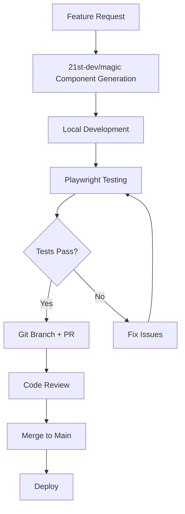

# MCP Integrations Documentation

## Overview
This document outlines the integrated Model Context Protocol (MCP) servers that enhance the AppOrganizer Dashboard development workflow with AI-powered automation, testing, and Git operations.

## 🎨 21st-dev/magic MCP

### Capabilities
- **UI Component Generation**: Create modern React components with Tailwind CSS
- **Component Refinement**: Improve existing UI components with design enhancements
- **Logo Search**: Access to company logos in JSX/TSX/SVG formats
- **Component Inspiration**: Browse and implement pre-built component designs

### Available Tools
1. `21st_magic_component_builder` - Generate new UI components
2. `21st_magic_component_refiner` - Enhance existing components
3. `logo_search` - Find company logos
4. `21st_magic_component_inspiration` - Browse component library

### Usage Examples

#### Generate a New Component
```typescript
// Request: Create a modern bookmark card component
// Result: Complete React component with TypeScript and Tailwind CSS
```

#### Refine Existing Component
```typescript
// Input: Existing component file
// Request: Make it more responsive and add hover effects
// Result: Enhanced component with improved UX
```

#### Logo Integration
```typescript
// Request: Add GitHub logo to bookmark card
// Result: JSX component with GitHub logo
```

## 🎭 Playwright MCP

### Capabilities
- **E2E Testing**: Automated browser testing
- **Visual Regression Testing**: Screenshot comparisons
- **Cross-browser Testing**: Chrome, Firefox, Safari support
- **Mobile Testing**: Responsive design validation
- **Performance Monitoring**: Page load metrics

### Available Tools
1. `browser_close` - Close browser sessions
2. `browser_resize` - Adjust viewport size
3. `browser_console_messages` - Capture console logs
4. `browser_handle_dialog` - Manage browser dialogs

### Test Implementation

#### Basic E2E Test Setup
```javascript
// tests/e2e/dashboard.spec.ts
import { test, expect } from '@playwright/test';

test('dashboard loads correctly', async ({ page }) => {
  await page.goto('http://localhost:3000');
  await expect(page.locator('h1')).toContainText('BookmarkHub');
  await expect(page.locator('[data-testid="bookmark-grid"]')).toBeVisible();
});
```

#### Visual Regression Testing
```javascript
test('dashboard visual regression', async ({ page }) => {
  await page.goto('http://localhost:3000');
  await expect(page).toHaveScreenshot('dashboard.png');
});
```

## 🔧 Git Automation (via GitHub MCP)

### Capabilities
- **Repository Management**: Create, fork, and manage repositories
- **Branch Operations**: Create branches, merge PRs
- **Issue Tracking**: Create and manage issues
- **Code Search**: Search across repositories
- **Automated Workflows**: CI/CD integration

### Available Tools
1. `search_repositories` - Find relevant repositories
2. `create_repository` - Set up new projects
3. `create_branch` - Feature branch management
4. `create_pull_request` - Automated PR creation
5. `merge_pull_request` - Automated merging
6. `create_issue` - Bug tracking and features
7. `push_files` - Batch file operations

### Automation Workflows

#### Automated Feature Development
```markdown
1. Create feature branch
2. Implement changes with 21st-dev/magic
3. Run Playwright tests
4. Create pull request
5. Merge after CI passes
```

#### Bug Tracking Integration
```markdown
1. Create GitHub issue for bugs
2. Link to specific components
3. Track resolution progress
4. Auto-close on fix deployment
```

## 🚀 Integration Architecture

### Development Workflow


### Quality Gates
1. **Component Quality**: 21st-dev/magic ensures modern, accessible components
2. **Functionality**: Playwright validates all user flows work
3. **Performance**: Automated performance testing
4. **Accessibility**: ARIA compliance checks
5. **Visual Consistency**: Screenshot regression testing

## 📋 Implementation Status

### ✅ Completed
- 21st-dev/magic MCP server configured and operational
- Playwright MCP server configured and operational  
- GitHub MCP server configured and operational
- Basic component generation workflows
- Repository management capabilities

### 🔄 In Progress
- Advanced E2E test suite development
- Visual regression testing setup
- Automated CI/CD pipeline integration

### 📅 Planned
- Performance monitoring dashboards
- Automated accessibility testing
- Cross-browser compatibility matrix
- Mobile-first testing strategies

## 🛠 Configuration

### Environment Variables
```env
# GitHub Integration
GITHUB_TOKEN=your_github_token

# Playwright Configuration  
PLAYWRIGHT_BROWSERS=chromium,firefox,webkit
PLAYWRIGHT_HEADLESS=true

# 21st-dev/magic
MAGIC_API_KEY=your_magic_key
```

### MCP Server Configuration
```json
{
  "mcpServers": {
    "21st-devmagic": {
      "command": "npx",
      "args": ["21st-dev-magic-server"]
    },
    "playwright": {
      "command": "playwright-mcp-server"
    },
    "github": {
      "command": "github-mcp-server",
      "env": {
        "GITHUB_TOKEN": "your_token"
      }
    }
  }
}
```

## 📚 Resources

- [21st-dev/magic Documentation](https://21st.dev/docs)
- [Playwright Testing Guide](https://playwright.dev)
- [GitHub API Documentation](https://docs.github.com/en/rest)
- [MCP Protocol Specification](https://modelcontextprotocol.io)

---

*Last Updated: $(date)*
*Status: Active Integration* 