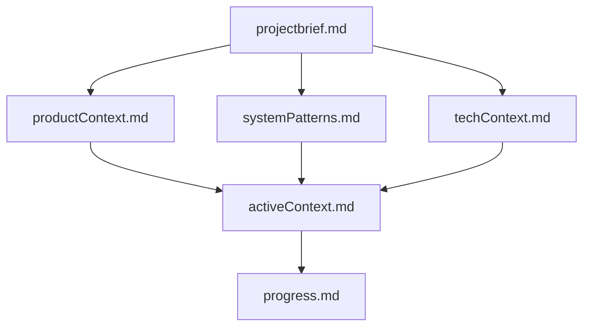

# BookmarkHub Memory Bank

## Overview

The Memory Bank is a comprehensive documentation system designed to maintain project continuity and context across development sessions. Since AI agents reset between sessions, this documentation serves as the critical knowledge base for understanding the project's current state, architecture, and development approach.

## File Structure

### Core Required Files

#### 📋 `projectbrief.md`
**Foundation document that shapes all other files**
- Project vision and value proposition
- User personas and use cases
- Guiding principles and technical foundation
- Success metrics and project scope
- *Read First* - This document defines the project's core identity

#### 🎯 `productContext.md`
**Why this project exists and how it should work**
- Problem statements and market analysis
- User experience goals and workflow patterns
- Design philosophy and success indicators
- Product strategy and positioning

#### 🏗️ `systemPatterns.md`
**System architecture and technical decisions**
- High-level architecture overview
- Key technical decisions and rationale
- Component architecture patterns
- Database schema and security patterns
- Testing and performance optimization patterns

#### ⚙️ `techContext.md`
**Technologies used and development setup**
- Complete technology stack documentation
- Development environment setup
- Project structure and configuration
- Technical constraints and considerations
- API integration patterns and monitoring

#### 🎯 `activeContext.md`
**Current work focus and recent changes**
- Current objectives and recent implementations
- Component architecture improvements
- System state and working features
- Next steps and active decisions
- Development approach and user preferences

#### 📊 `progress.md`
**What works, what's left to build, current status**
- Completed features with detailed breakdown
- Future features and priorities
- Current system health and quality metrics
- Known issues and development velocity
- Sprint planning and technical debt

## File Hierarchy

The files build upon each other:
1. **Project Brief** provides the foundation
2. **Product Context**, **System Patterns**, and **Tech Context** elaborate on different aspects
3. **Active Context** synthesizes current state
4. **Progress** tracks implementation status

## Usage Guidelines

### For New Development Sessions
1. **Always read ALL memory bank files** before starting work
2. **Start with `projectbrief.md`** to understand the project's core identity
3. **Review `activeContext.md`** for current state and recent changes
4. **Check `progress.md`** for what's working and what needs attention
5. **Reference technical files** as needed for implementation details

### When to Update Memory Bank
- **After significant feature implementations**
- **When user requests "update memory bank"**
- **When discovering new project patterns or preferences**
- **After architectural changes or technical decisions**
- **When user provides feedback that changes project direction**

### Memory Bank Update Process
When updating (especially when triggered by **update memory bank** command):
1. **Review ALL files** - even those that may not need updates
2. **Focus on `activeContext.md`** - update current work focus and recent changes
3. **Update `progress.md`** - reflect new completions and current status
4. **Modify other files** as needed based on new information
5. **Maintain consistency** across all files

## Key Project Intelligence

### User Preferences (Critical)
- **Environment-First Approach**: Always fix issues before adding new features
- **Explicit Change Requests**: Only implement changes specifically requested
- **Professional Design**: Clean, minimal interface without emoji clutter
- **Heading Capitalization**: ALL CAPS for H1, H2, H3 headings throughout
- **Folder-First Organization**: Folders as primary method of organization

### Development Approach
- **Type Safety**: Strict TypeScript throughout
- **Component Composition**: Favor small, reusable components
- **User-Driven**: Only make changes explicitly requested by user
- **Documentation Heavy**: Maintain comprehensive project memory
- **Quality First**: Resolve errors before proceeding with new features

### Technical Patterns
- **Next.js 15 with App Router** for modern React patterns
- **Supabase + Clerk** for backend and authentication
- **React Context** for global state management
- **Tailwind CSS + Radix UI** for styling and components
- **Component-First Architecture** with clear separation of concerns

## File Maintenance

### `activeContext.md` (Most Dynamic)
- Update after every significant change
- Track current work focus and recent implementations
- Document user preferences and development approach
- Maintain list of working features and next steps

### `progress.md` (Regularly Updated)
- Update completion status after feature implementations
- Maintain current system health metrics
- Update sprint planning and priorities
- Track development velocity and quality metrics

### Other Files (Updated as Needed)
- **Project Brief**: Update when scope or vision changes
- **Product Context**: Update when user needs or market understanding evolves
- **System Patterns**: Update when architectural decisions are made
- **Tech Context**: Update when technology stack or setup changes

## Memory Bank Benefits

1. **Project Continuity**: Maintains context across development sessions
2. **Decision History**: Preserves rationale for technical and design decisions
3. **User Preference Tracking**: Ensures consistent application of user preferences
4. **Development Efficiency**: Reduces time spent re-understanding project context
5. **Quality Maintenance**: Helps maintain code quality and architectural consistency
6. **Communication**: Provides clear communication about project status and direction

## Integration with `.cursorrules`

The Memory Bank works alongside the `.cursorrules` file, which captures:
- Critical implementation paths
- User workflow preferences
- Project-specific patterns
- Known challenges and solutions
- Evolution of project decisions

Together, these documentation systems ensure that development work remains consistent, efficient, and aligned with user expectations across all development sessions.

---

**Remember**: The Memory Bank is the AI's only link to previous work after memory resets. Its accuracy and completeness directly impact the effectiveness of future development sessions. 